## 知识点归纳

知识点 | 分数 | 说明 | 比例 
:-: | :-: | :-: | :-: 
软件工程基础知识 | 11 | 开发模型、设计原则、测试方法、质量特性、CMM、Pert图、风险管理 | 14.67% 
面向对象 | 12 | 面向对象基本概念、面向对象分析与设计、UML、设计模式 | 16.00% 
数据结构与算法 | 10 | 数组、栈、队列、树与二叉树、图、查找与排序、常见算法 | 13.33%  
程序设计语言 | 6 | 文法、有限自动机、正规式、语句的作用、语句的语义、程序的控制结构、函数调用的参数传递、各种程序语言的特点比较 | 8.00% 
计算机硬件基础 | 6 | 浮点数运算、溢出、算术、逻辑运算、计算机体系结构分类、指令系统基础、CISC与RISC、流水线、Cache存储器可靠性分析、校验方法 | 8.00% 
操作系统 | 6 | 进程状态转换图、信号量与PV操作、死锁问题、银行家算法、段页式存储、页面置换算法、硬盘调度、树形文件系统 | 8.00% 
数据库系统 | 6 | E-R模型、关系代数、元祖运算、规范化理论（键、范式、模式分解）、并发控制 | 8.00% 
计算机网络 | 5 | OSI模型、TCP/IP协议族、子网划分、常见的网络命令 | 6.67% 
信息安全知识 | 3 | 加密解密技术、网络完全、计算机病毒 | 4.00% 
多媒体基础 | 3 | 多媒体基本概念、计算声音、图像、视频文件的容量、JPEG、MPEG | 4.00% 
知识产权与标准化 | 2 | 作品保护时间、侵权判定、知识产权归属、标准的分类、标准代号 | 2.67% 

## 计算机组成与体系结构

### 数据的表示

- R进制转十进制使用按权展开法

例如二进制10100.01 = 1x24+1x22+1x2-2

- 十进制转R进制使用短除法

例如51/2=25余1,25/2=12余1,12/2=6余0,6/2=3余0,3/2=1余1,1/2=0余1，
十进制51转换为二进制为110011

- 冯-诺依曼计算机体系架构没办法直接做减法，减法是通过加法来实现的。原码、反码、补码的产生过程，就是为了解决计算机做减法和引入符号位（正号和负号）的问题。
- 原码：是最简单的机器数表示法。用最高为表示符号位，'1'表示负号，'0'表示正号。其他位存放该数的二进制的绝对值。
- 反码：是为解决原码的正数与负数相加运算bug问题。正数的反码还是等于原码，负数的反码就是他的原码除符号位外，按位取反。
- 补码：是真正解决负数运算问题。正数的补码等于他的原码，负数的补码等于他的原码自低位向高位，尾数的第一个'1'及其右边的'0'保持不变，左边的各位按位取反，符号位不变。
- 浮点数运算。表示方法：N = M*Re，其中M称为尾数，e是指数，R是基数。浮点数运算流程：对阶-->尾数计算-->结果格式化。

### 计算机结构

- 基本的计算机结构如下图：

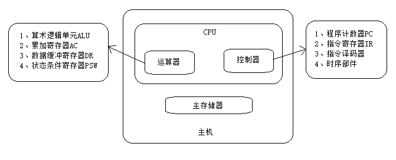

- Flynn根据指令流和数据流的不同组织方式，把计算机系统的结构分为以下四类：

体系结构类型 | 结构 | 关键特性 | 代表 
:-: | :-: | :-: | :-: 
单指令流单数据流SISD | 控制部分：一个 处理器：一个 主存模块：一个 |   | 单处理器系统 
单指令流多数据流SIMD | 控制部分：一个 处理器：多个 主存模块：多个 | 各处理器以异步的形式执行同一条指令 | 并行处理机 阵列处理机 超级向量处理机 
多指令流单数据流MISD | 控制部分：多个 处理器：一个 主存模块：多个 | 被证明不可能，至少不实际 | 目前没有，有文献称流水线计算机为此类 
多指令流多数据流MIMD | 控制部分：多个 处理器：多个 主存模块：多个 | 能够实现作业、任务、指令等各级全面并行 | 多处理机系统 多计算机 

- CISC与RISC：

指令系统类型 | 指令 | 寻址方式 | 实现方式 | 其它 
:-: | :-: | :-: | :-: | :-: 
CISC（复杂） | 数量多，使用频率差别大，可变长格式 | 支持多种 | 微程序控制技术（微码） | 研制周期长 
RISC（精简） | 数量少，使用频率接近，定长格式，大部分为单周期指令，操作寄存器，只有Load/Store操作内存 | 支持方式少 | 增加了通用寄存器，硬布线逻辑控制为主，适合采用流水线 | 优化编译，有效支持高级语言 

### 流水线

- 概念：流水线是指在程序执行时多条指令重叠进行操作的一种准并行处理实现技术。各种部件同时处理是针对不同指令而言的，它们可同时为多条指令的不同部分进行工作，以提高各部件的利用率和指令的平均执行速度。
- 流水线周期为执行时间最长的一段，流水线计算公式为：1条指令执行时间 + （指令条数-1）*流水线周期。理论公式：；实践公式：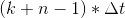
- 流水线吞吐率：是指咋单位时间内流水线所完成的任务数量或输出的结果数量。计算流水线吞吐率的最基本的公式如下：

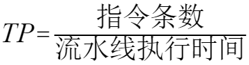

- 流水线最大吞吐率： 
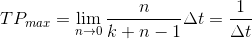

- 流水线的加速比。完成同样一批任务，不使用流水线所用的时间与使用流水线所用的时间之比称为流水线的加速比。基本公式如下：
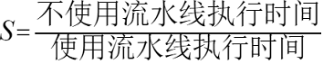

- 流水线的效率：是指流水线的设备利用率。在时空图上，流水线的效率定义为n个任务占用的时空区与k个流水段总的时空区之比。 流水线效率的计算公式：

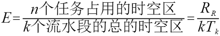

### 层次化存储结构

- cache的功能：提高CPU数据输入输出的速率，突破冯-诺依曼瓶颈，即CPU与存储系统间数据传送带宽限制。在计算机的存储系统体系中，Cache是访问速度最快的层次。使用Cache改善系统性能的依据是程序的局部性原理。

### 磁盘结构与参数

- 磁盘存取时间 = 寻道时间+等待时间（平均定位时间+转动延迟）

注意：寻道时间是指磁头移动到磁道所需时间；等待时间为等待读写的扇区转到磁头下方所用的时间。

### 主存的分类
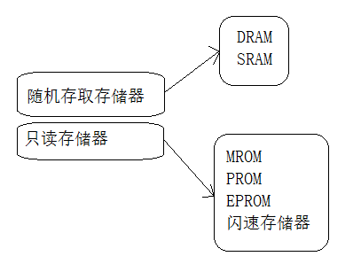

### 总线

- 根据总线所处的位置不同，总线通常被分成三种类型：

>内部总线：在CPU内部，寄存器之间和算术逻辑部件ALU与控制部件之间传输数据所用的总线。

>系统总线：又称内总线或板级总线，是微机中个插件板与系统板之间的总线，用于插件板一级的互联。因为该总线是用来连接微机各功能部件而构成一个完整微机系统的，所以称之为系统总线。
>>数据总线  
>>地址总线  
>>控制总线  

>外部总线：是计算机和外部设备之间的总线

### 系统可靠性分析与设计

- 可靠性R：指总它开始运行到某个时刻这段时间内能正常运行的概率。
- 失效率λ：指单位时间内失效的元件数与元件总数的比例。
- 串联系统：假设一个系统由N个子系统组成，当且仅当所有子系统都能正常工作时系统才能正常工作。  
可靠性计算：假设各个子系统的可靠性分别用R1R2...表示，则系统可靠性为：R = R1R2..Rn  
失效率计算：假设各个子系统的失效率分别用λ1λ2...表示，则系统失效率为：λ = λ1+λ2+...+λn
- 并联系统：假设一个系统由N个子系统组成，只要有一个子系统正常工作时系统就能正常工作。  
可靠性计算：假设各个子系统的可靠性分别用R1R2...表示，则系统可靠性为：R = 1-(1-R1)(1-R2)...(1-Rn)  
失效率计算：假设各个子系统的失效率用λ表示，则系统失效率为：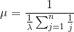

### 差错控制-CRC与海明校验码

- 码距：一个编码系统的码距是整个编码系统在红任意（所有）两个码字的最小距离。
- 循环校验码CRC：是数据通信领域中最常见的一种差错校验码，其特征是信息字段和校验字段的长度可以任意选定。通常用CRC校验工具来将数据进行对比，CRC校验工具一般分为CRC16和CRC32两种计算方式，所以CRC校验计算器也有两种。CRC校验码位数=生成多项式位数-1。CRC是一种数据传输检错功能，对数据进行多项式计算，并将得到的结果附在帧后面，接收设备也执行类似的算法，以保证数据传输的正确性和完整性。
- 海明校验码：被广泛采用的一种很有效的校验方法，是只要增加少数几个校验位，就能检测出二位同时出错、亦能检测出一位出错并能自动恢复该出错位的正确值的有效手段，后者被称为自动纠错。它的实现原理是在k个数据位之外加上r个校验位，从而形成一个k+r位的新的码字，使新的码字的码距均匀地拉大。把数据的每一个二进制位分配在几个不同的偶校验位的组合中，当某一位出错后，就会引起相关的几个校验位的值发生变化，这不但可以发现出错，还能指出是哪一位出错，为进一步自动纠错提供了依据。

- 海明校验码的位数r遵循条件：2r>=x+r+1，其中r为海明校验码位数，x为信息码位数。

## 操作系统基本原理

### 概述
- 管理系统的硬件、软件、数据资源
- 控制程序运行
- 人机之间的接口
- 应用软件与硬件之间的接口
- 操作系统的管理职能：进程管理、存储管理、文件管理、作业管理、设备管理

### 进程的状态
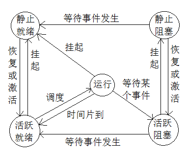

- PV操作：是一种实现进程互斥与同步的有效方法。PV操作与信号量的处理相关，P操作代表的是对资源的申请，V操作是释放资源的操作，流程图如下：
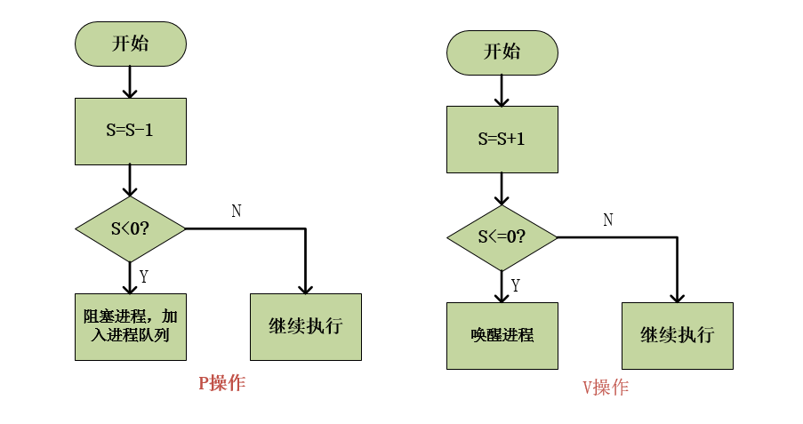
- 单缓冲区生产者、消费者问题PV原语描述：  
  
s1可以看做是代表一个缓冲位，s2可以看做是代表一个产品
- 进程管理是操作系统的核心，但如果设计不当，就会出现死锁的问题，如果一个进程在等待一件不可能发生的事情，则进程产生死锁，而如果一个或多个进程产生死锁，就会造成系统死锁。
- 死锁的避免：1、有序资源分配法，2、银行家算法

### 存储管理

- 连续存储分配算法：1、首次适应法，2、最佳适应法，3、最差适应法，4、循环首次适应法
- 页式存储（不连续存储）：就是把内存物理空间划分成大小相等的若干区域，一个区域称为一个块。把逻辑地址空间划分为大小相等的若干页，页大小与块大小相等。“页”是逻辑单位，“块”是物理单位。分配内存时，以块为单位将进程中的若干个页分别装入到多个可以不相邻的物理块中。
- 页式存储优点：利用率高，碎片小，分配与管理简单。
- 页式存储缺点：增加了系统开销；可能产生抖动现象。
- 页式存储地址结构：页号、页内地址（位移量）
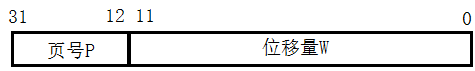  
页内地址的位数可以决定页的大小，逻辑地址=页号&位移量
- 地址映射（逻辑地址-->物理地址）：物理地址=块号&块内地址。因为块的大小=页的大小，所以块内位移量=页内位移量，所以只需求出块号即可。可通过页表求得块号：  
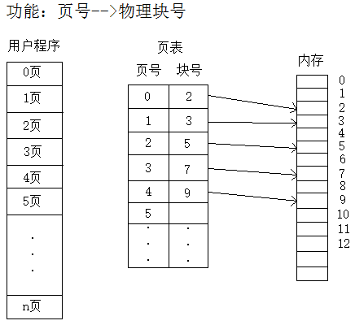
- 段式存储：是指把一个程序分成若干个段进行存储，每个段都是一个逻辑实体。段式管理是通过段表进行的，它包括段号或段名、段起点、装入点、段的长度等。内存空间为每个段分配一个连续的分区。段的长度由相应的逻辑信息组的长度决定，因而各段长度不等，引入分段存储管理方式的目的主要是为了满足用户在编程和使用上多方面的要求。

- 段式存储优点：多道程序共享内存，各段程序修改互不影响。
- 段式存储缺点：内存利用率低，内存碎片浪费大。
- 段式存储地址结构：段号、段内地址（位移量）
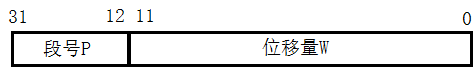  
段号的位数决定了每个进程最多可以分几个段，段内地址的位数可以决定段的大小，逻辑地址=段号&段内地址。每个段对应一个段表项，其中记录了该段在内存中的其实位置（基址）和段的长度。
- 地址映射（逻辑地址-->物理地址）：物理地址=基址+段内地址，可通过段表求得基址：
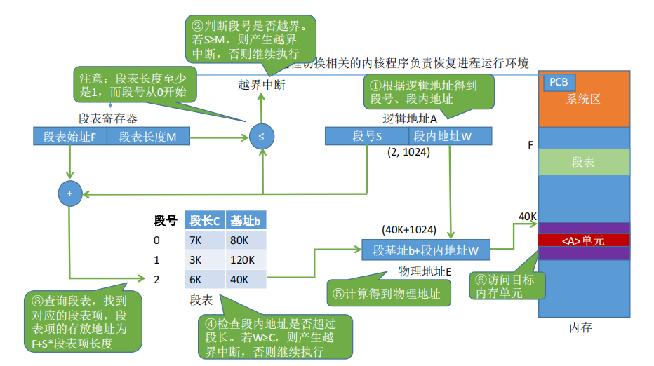
- 段的保护：1、越界中断处理，进程在执行过程中，有时需要扩大分段，如数据段。由于要访问的地址超出原有的段长，所以发越界中断。操作系统处理中断时，首先判断该段的“扩充位”，如可扩充，则增加段的长度，否则按出错处理。2、缺段中断处理，检查内存中是否有足够的空闲空间，若有，则装入该段，修改有关数据结构，中断返回；若没有，检查内存中空闲区的总和是否满足要求，是则应采用紧缩技术，转1，否则。淘汰一些段，转1。
- 段的动态链接：大型程序由若干程序段，若干数据段组成，进程的某些程序段在运行期间可能根本不用，互斥执行的程序段没有必要同时驻留内存，有些程序段执行一次后不再用到，静态链接花费时间，浪费空间。在一个程序运行开始时，只将主程序段装配好并调入主存，其它各段的装配是在主程序段运行过程中逐步进行的。每当需要调用一个新段时，再将这个新段装配好，并与主程序段链接。
- 页式存储和段式存储对比：  
    1. 页式信息的物理单位。分页的主要目的是为了实现离散分配，提高内存利用率。分页仅仅是系统管理上的需要，完全是系统行为，对用户是不可见的。
    2. 段式信息的逻辑单位。分段的主要目的的更好地满足用户需求，一个段通常包含着一组属于一个逻辑模块的信息。分段是对用户可见的，用户编程时需要显式地给出字段名。
    3. 页的大小是固定且由系统决定。段的长度却不固定，决定于用户编写的程序。
    4. 分页的用户进程地址空间是一维的，程序员只需给出一个记忆符即可表示一个地址。
    5. 分段的用户进程地址空间是二维的，程序员在标识一个地址时，既要给出段名，也要给出段内地址。
    6. 分段比分页更容易实现信息的共享和保护。不能被修改的代码称为纯代码或可重入代码（不属于临街资源），这样的代码是可以共享的。可修改的代码是不能共享的。
    7. 访问一个逻辑地址需要几次访存？分页（单级分页）：第一次访存-->查内存中的页表，第二次访存-->访问目标内存单元。总共两次访存。分段：第一次访存-->查内存中的段表，第二次访存-->访问目标内存单元。总共两次访存。

- 段页式存储：用户程序先分段，每个段内部再分页（内部原理同基本的分页、分段相同）
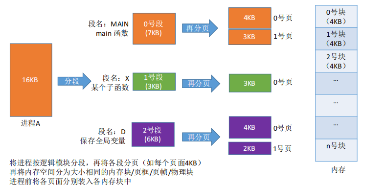
- 段页式地址结构：段号、段内页号、页内地址（偏移量）。
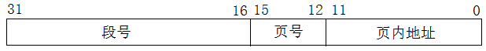  
段号的位数决定了每个进程最多可以分几个段，页号的位数决定了每个段最大有多少页，页内偏移量决定了页面大小、内存块大小是多少。“分段”对用户是可见的，程序员编程时需要显式地给出段号，段内地址。二将各段“分页”对用户是不可见的。系统会根据段内地址自动划分页号和页内便宜量。因此段页式管理的地址结构是二维的。
- 地址映射：逻辑地址-->段号、段内页号、页内地址，段表寄存器-->段表始址，段号+段内页号-->存储块号，块号+页内地址-->物理地址：

- 段页式存储地址转换原理：

- 段页式存储优点：保留了分段和请求分页存储管理的全部优点，提供了虚拟空间，能更有效利用主存。
- 段页式存储缺点：增加了硬件成本，系统复杂度较大。
- 快表：是一块小容量的相连存储器，由高速缓存器组成，速度快，并且可以从硬件上保证按内容并行查找，一般用来存放当前访问最频繁的少数活动页面的页号。
- 页式存储管理置换算法：进程运行时，若其访问的页面不在内存而需将其调入，但内存已无空闲空间时，就需要从内存中调出一页程序或数据，送入磁盘的对换区。选择调出页面的算法就称为页面置换算法。好的页面置换算法应有较低的页面更换频率，也就是说，应将以后不会再访问或者较长时间内不会再访问的页面先调出。
- 置换策略理论：
    1. 最佳置换算法（OPT）：最佳置换算法所选择的被淘汰页面是以后永不使用的，或者是在最长时间内不再被访问的页面，这样可以保证获得最低的缺页率。但由于人们目前无法预知进程在内存下的若干页面中哪个是未来最长时间内不再被访问的，因而该算法无法实现。
    2. 先进先出（FIFO）页面置换算法：优先淘汰最早进入内存的页面，亦即在内存中驻留时间最久的页面。改算法实现简单，只需把调入内存的页面根据先后次序链接成队列，设置一个指针总指向最早的页面。但该算法与进程实际运行时的规律不适应，因为在进程中，有的页面经常被访问。
    3. 最近最久未使用（LRU）置换算法：选择最近最长时间未被访问过的页面予以淘汰，它认为过去一段时间内未被访问过的页面，在最近的将来可能也不会被访问。该算法为每个页面设置一个访问字段，来记录页面自上次被访问以来所经历的时间，淘汰页面时选择现有页面中值最大的予以淘汰。
- 页面置换算法策略比较：
    1. 三种置换算法的优劣：
        - 优点：
            - FIFO页面置换算法实现简单，要求的硬件支持较少。
            - OPT页面置换算法可保证获得最低的缺页率，并且可以用来评价其他算法。
            - LRU页面置换算法利用“最近的过去”代替“最近的将来”，以此模拟OPT算法，是实际应用中缺页率最低的算法。
        - 缺点：
            - FIFO算法所依据的条件是各个页面调入内存的时间，而页面调入内存的先后并不能反映页面的使用情况。
            - OPT算法是理论上的算法，目前该算法是无法实现的。
            - LRU算法是根据各页以前的使用情况，来代替各页面将来的使用情况，进而判断要替换出去的页面，而页面过去和将来的走向之间并无必然的联系；其实际应用时要求较多的硬件支持，因而多采用近似算法。
    2. 在什么情况下采用哪种置换算法更有利？
        - FIFO算法在按线性顺序访问地址空间时使用；当硬件水平不足时，FIFO算法也可作为首选。
        - OPT算法可以进行模拟实验分析或理论分析。
        - 当系统由寄存器或栈的硬件支持时，利用LRU算法可以获得最低缺页率。
